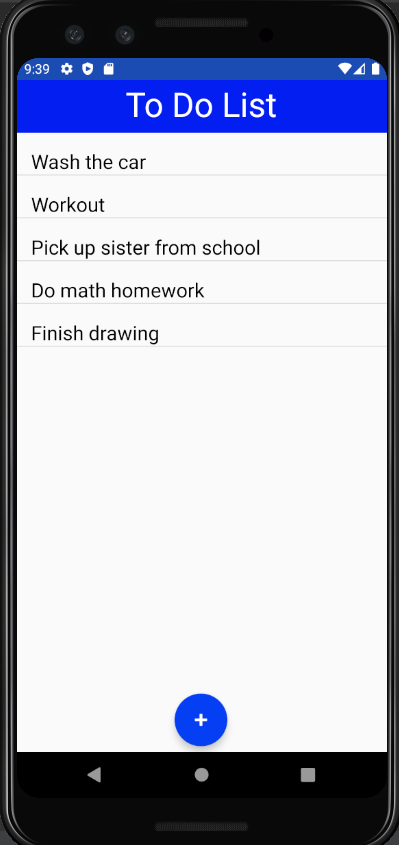
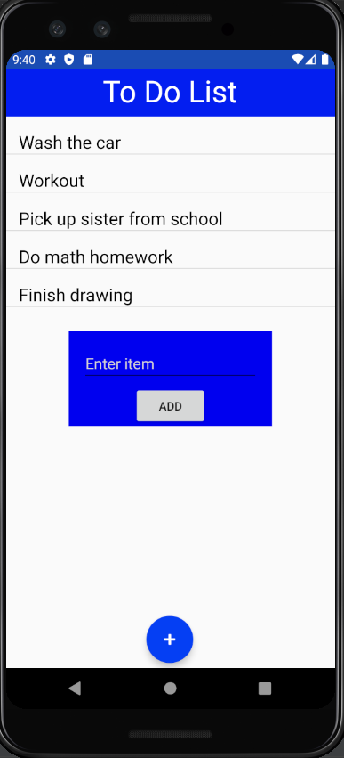
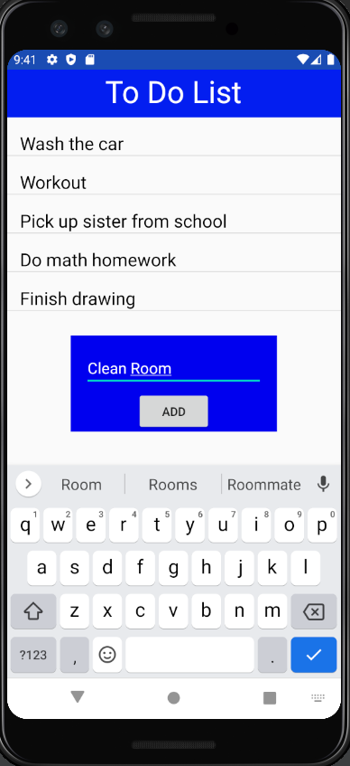
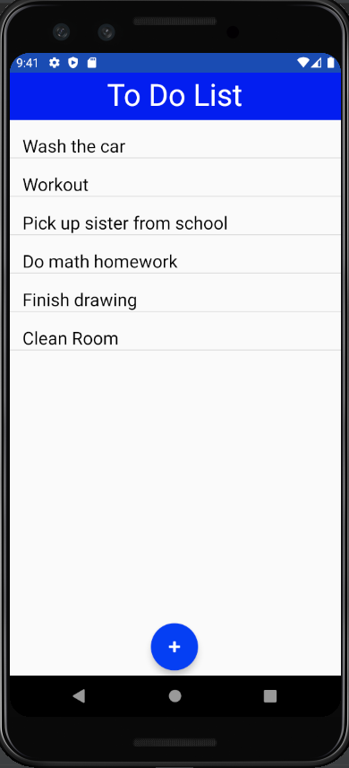
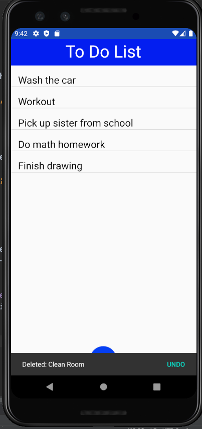

# ToDoList
Simple To Do List Android Application

This app allows users to add items to a to do list.  
Deleting an item is as simple as sliding the item to the left.  
When an item is deleted, the user has the option to undo the delete.   

. 

. 

. 
